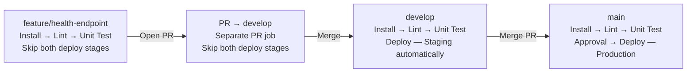

# Lab 04 branch strategy

GitHub `push` and `pull_request` events are delivered to `/github-webhook/` and trigger the Multibranch Pipeline. Branch discovery includes all lab branches, and origin PR discovery creates a distinct `PR-<number>` job.

`when { branch 'develop' }` enables staging. Production uses `branch 'main'`, `beforeInput true`, and the input message `Deploy to production?`. Evaluating the branch condition before input prevents feature, PR and develop builds from waiting for a production approval.

Both deploy stages use the lab's echo commands. They do not deploy an application to an external production service.

The public tunnel exposes only signed webhook POSTs through a gateway. Jenkins administration stays at `http://localhost:8081/`. A quick tunnel URL may change when its process restarts; update the GitHub webhook URL if it changes.
